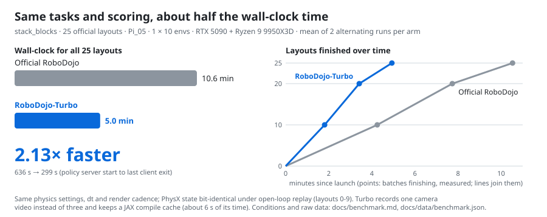
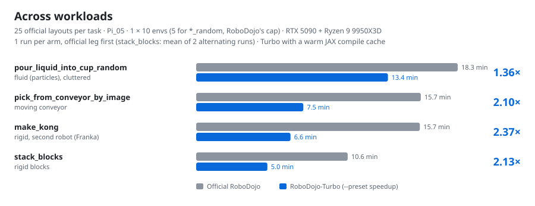
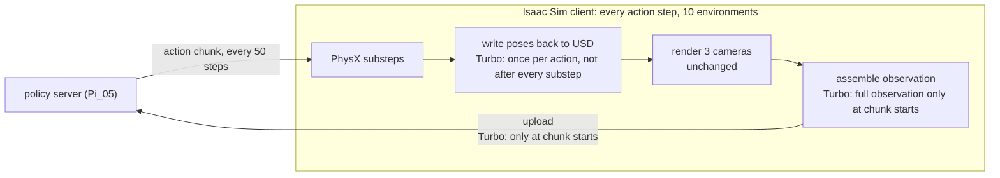

# RoboDojo-Turbo (work in progress)

[-0969da)](#measured-so-far)
[-2da44e)](docs/validation.md)
[](#how-it-works)
[](LICENSE)
[](docs/STATUS.md)

**Evaluate policies on [RoboDojo](https://github.com/RoboDojo-Benchmark/RoboDojo) 1.4–2.4× faster on the same
machine, with the same physics and scoring code.** RoboDojo-Turbo patches your local RoboDojo checkout: tasks, official
layouts, checkpoints, scoring code, physics, `dt` and render cadence stay as upstream; host-side overhead is removed, and
the recommended preset records one camera video instead of three. Measured with the Pi_05 policy on one RTX 5090 +
Ryzen 9 9950X3D over four tasks: PhysX state under open-loop replay is bit-identical with every switch off and with the
speedup preset (`stack_blocks`, 10 layouts), and pooled over the four tasks (125 paired layouts) the closed-loop score
changed by +0.7 points, 95% CI [-4.2, +5.5], with 16 vs 15 successes ([details](#measured-so-far),
[limits](#known-limitations)). Use it for the inner loop of policy research (screening checkpoints, ablations, quick
checks before a full evaluation) and confirm final numbers on unpatched RoboDojo.

<sub>Unofficial: not affiliated with or endorsed by the RoboDojo maintainers, XPolicyLab, Physical Intelligence or
NVIDIA. Local results are not leaderboard entries; official RoboDojo scores come only from the maintainers' evaluation
system.</sub>

<picture>
  <source media="(prefers-color-scheme: dark)" srcset="docs/img/hero-dark.svg">
  
</picture>
<picture>
  <source media="(prefers-color-scheme: dark)" srcset="docs/img/workloads-dark.svg">
  
</picture>

> Status: pre-release preview (CHANGELOG.md). Timed with this code on one machine and four tasks, scores compared on one task; see Known limitations and [docs/STATUS.md](docs/STATUS.md).

## How it works

**Where the time goes.** A RoboDojo evaluation is one loop in an Isaac Sim process. For every action step, PhysX advances
all 10 environments by a few substeps, three cameras are rendered, an observation is assembled and sent to the policy
server, and every 50 steps the policy returns the next chunk of actions. Physics and rendering run on the GPU, but the
loop around them runs in Python on a single CPU thread: after every substep it writes each body's pose back into the USD
scene (and UI listeners that a headless run never shows react to every write), it copies control dictionaries and
observations, and it assembles and uploads images the policy does not read. That thread, not the GPU, sets the pace.



**What RoboDojo-Turbo removes.** Only work on that CPU thread that is not meant to change what is simulated, what the
policy is shown at the steps it acts on, or what is scored (one known exception is listed below):

| upstream spends time on | RoboDojo-Turbo | measured effect (`stack_blocks`, 10 envs) |
|---|---|---|
| uploading the raw images of 10 envs x 3 cameras on every step (~27.6 MB), although Pi_05 reads only the observation at each chunk start | upload at chunk starts only; frames in between are still rendered, for the video | whole evaluation 636 -> 546 s with the harness preset (this, the lossless fast path below and one camera video) |
| writing every pose back to USD after every physics substep, and five UI-only listeners reacting to each write | write back once per action, before anything reads the scene (the last substep is kept for fluids and cloth); revoke the UI listeners | physics step 148 -> 51 ms |
| assembling a full observation on steps that only feed the video, and RGBA readout | read out only the recorded cameras on those steps, 3-channel readout | observation step 112 -> 80 ms |
| deep copies and duplicate recomputation of controls, observations and joint targets | lossless removal, each checked byte for byte against the original path | part of the two rows above |
| building the unused motion planner, fetching NVIDIA assets online, garbage-collection pauses, video encoding | skip the planner for joint actions, local asset mirror, `gc.freeze`, lighter video settings | start-up, memory (about 1.8 GB VRAM per process) |
| rendering | unchanged | 82 -> 80 ms per step |

Step times are per action step from the span traces of the benchmark runs, harness vs full preset (the unpatched arm is
not traced); the numbers behind every row are in [docs/switches.md](docs/switches.md) and `docs/data/benchmark.json`.

**What stays the same.** Tasks, official layouts, checkpoints and scoring code; physics settings, `dt` and substeps; every
frame is rendered. Known differences: the recommended preset records one camera video instead of three (videos are not
scored), and bodies that fall asleep during an action can be up to 1.2 mm stale in the rendered scene
([Known limitations](#known-limitations)).

**How it is applied.** `python -m robodojo_turbo apply` rewrites 13 files of your own RoboDojo checkout at regex anchors
and installs three helper modules; it refuses unless each file matches the pinned upstream version (RoboDojo 726e9aa,
XPolicyLab bb9a0b5) byte for byte. Every change sits behind an `RDTURBO_*` switch that is off unless you set it, so a
patched tree with no switches behaves like upstream, and `revert` restores the original files byte for byte. This
repository carries no upstream source beyond what the patches need: single-line regex anchors, a few re-implemented
RoboDojo expressions, and adapted versions of one XPolicyLab and one Isaac Sim function (all attributed in NOTICE).

**How it is checked.** Open-loop replay: the same recorded actions, run with every switch off and with the full preset,
must give bit-identical PhysX state. Check modes: fast and original path run side by side on the same data and are
compared byte for byte. Paired scores: the same layouts evaluated with and without the preset, compared against the
spread of the same code run twice ([How the speedups are verified](#how-the-speedups-are-verified)).

## What is patched

* **Harness** (`--profile harness`): layout sharding across processes, one policy server per worker, span tracing, and
  for the Pi_05 policy loop an option to upload observations only at action-chunk starts (the only observation the
  Pi_05 server reads; with 10 envs x 3 cameras at 640x480 the upstream loop uploads ~27.6 MB of raw images on every
  step and the server overwrites 49 of 50).
* **Speedup switches** (`--profile speedup`): ten in-process changes that remove host-side work, e.g. revoking UI-only
  USD listeners that a headless run never reads, writing PhysX poses back to USD once per action instead of every
  substep, 3-channel RGB readout, and a few copy/recompute removals. Five have a `=check` mode that computes the fast
  and the upstream result on the same data and counts mismatches (`VIDEO_ONLY_OBS` incl. `RGB3`, `CTRL_CACHE`,
  `PARENT_CACHE`, `PCI_COPY`, `BATCH_TENSOR`); `USD_LAST=check` compares the USD pose that rendering and
  scorers read with the PhysX pose; `REVOKE_LISTENERS` and `GC` have no check mode.
* **Ops** (`--profile all`): skip building the unused cuRobo planner (joint actions only), an offline mirror of the nine
  NVIDIA material files every scene fetches, an optional server memory fraction (`RDTURBO_SERVER_MEM_FRACTION`).

Every switch is off unless its `RDTURBO_*` environment variable is set; with all switches off the patched tree behaves
like upstream, and `python -m robodojo_turbo revert` restores the upstream files byte for byte. The recommended preset
(`robodojo_turbo/presets/speedup.env`) sets 16 settings on top of the harness: the ten speedup switches, the two ops
switches `NO_PLANNER` and `OFFLINE_ASSETS`, the launcher's `OVERLAP_START`, and three JAX/XLA settings for the policy
server (`JAX_COMPILATION_CACHE_DIR`, `XLA_PYTHON_CLIENT_PREALLOCATE=false`, `XLA_PYTHON_CLIENT_ALLOCATOR=platform`).
[docs/switches.md](docs/switches.md) describes each one.

## Requirements

* Linux, an NVIDIA GPU, and a working RoboDojo installation: its install script creates the conda env `RoboDojo`
  (Isaac Sim 5.1, Isaac Lab), the Pi_05 policy environment of XPolicyLab, the assets and the checkpoints you evaluate.
  Evaluations with plain upstream RoboDojo should already run.
* Windows: not supported (the Pi_05 policy server's openpi is tested on Ubuntu 22.04 only, JAX has no native Windows
  GPU build, and RoboDojo's install and evaluation scripts are bash); WSL2 untested.
* The pinned upstream versions (the patcher refuses others unless you pass `--force-unpinned`):
  ```bash
  git -C /path/to/RoboDojo checkout 726e9aa
  git -C /path/to/RoboDojo submodule update --init XPolicyLab
  git -C /path/to/RoboDojo/XPolicyLab checkout bb9a0b5      # d6332bf also works
  ```
* Run the commands below from this checkout, inside `conda activate RoboDojo` (Python 3.11), or `pip install .` to use
  `python -m robodojo_turbo` from anywhere. The launcher activates the conda env `RoboDojo` itself; pass
  `--conda-env <name>` for another name, or `--conda-env ''` to use the current environment.
* Isaac Sim asks you to accept NVIDIA's licenses: read the
  [NVIDIA Omniverse License Agreement](https://docs.isaacsim.omniverse.nvidia.com/5.0.0/common/NVIDIA_Omniverse_License_Agreement.html)
  and the [Isaac Sim Additional Software and Materials License](https://docs.isaacsim.omniverse.nvidia.com/5.0.0/common/license-isaac-sim-additional.html)
  (see your Isaac Sim version's documentation). The launcher never accepts them for you.

## Quick start

```bash
git clone https://github.com/Raymondlol/RoboDojo-Turbo.git && cd RoboDojo-Turbo
python -m robodojo_turbo list                                  # patches, profiles, switches, presets
python -m robodojo_turbo apply --root /path/to/RoboDojo        # --profile all (default); refuses unpinned upstream files
bash scripts/mirror_nv_assets.sh                               # optional: offline NVIDIA material mirror
export OMNI_KIT_ACCEPT_EULA=YES                                # only after you have read NVIDIA's licenses (above)
bash scripts/rdturbo_eval.sh --rd /path/to/RoboDojo --tag demo --preset speedup \
     --task stack_blocks --ckpt RoboDojo-sim-arx_x5-joint-0 --seed 0 --layouts 25
python -m robodojo_turbo revert --root /path/to/RoboDojo       # byte-exact restore
```

The launcher writes `runs/<tag>/`: merged score (`merged_result.json`), traces, a bubble report, GPU samples, and per
worker accounting. It exits non-zero if layouts are missing, a batch was skipped by RoboDojo's generic exception handler,
or no worker trace grew for `--stall-timeout` seconds (default 1200). Layouts that RoboDojo itself drops as physically
unstable are listed as `unstable_layouts`. Before it starts anything it checks that the tree is fully patched and that
every `RDTURBO_*` value is valid and backed by its patch (`python -m robodojo_turbo check-env --root ...`); the speedup
preset needs `--profile all`. To load a preset into your shell: `set -a; source robodojo_turbo/presets/speedup.env; set +a`.

Revert before `git clean`, `git stash -u`, `git pull` or copying the RoboDojo tree: the patch state lives in
`<RoboDojo>/.robodojo_turbo/`. If it is lost anyway, `status` and `revert` detect the injected code and print the exact
`git checkout` commands that restore the upstream files.

Tests (no GPU): `RDTURBO_TEST_UPSTREAM=/path/to/pinned/RoboDojo python -m pytest -q` (without the variable the patch
matrix against upstream is skipped).

## Measured so far

Same machine, same session, alternating order, two repetitions (2026-09-27, pre-release build,
`scripts/reproduce_benchmark.sh`): one RTX 5090 + Ryzen 9 9950X3D, driver 580.178.04, Isaac Sim 5.1 / Isaac Lab 2.3.2
(isaaclab extension 0.54.3) / omni.physx 107.3.26, RoboDojo 726e9aa + XPolicyLab bb9a0b5, task `stack_blocks`, the 25
official layouts (seed 0), arx_x5 joint actions, RoboDojo's released pi0.5 checkpoint (`RoboDojo-sim-arx_x5-joint-0`,
step 59999), 1 process x 10 envs (batches of 10, 10, 5). Wall clock = `wall_total` (policy server start to last client
exit). No other process on the GPU.

| arm | what runs | wall clock (rep 1 / rep 2) | vs upstream | successes (rep 1 / rep 2) |
|---|---|---:|---:|---:|
| upstream | unpatched RoboDojo (`python -m robodojo_turbo revert`), three camera videos | 638 s / 634 s | | 3/25, 6/25 |
| harness | `--preset harness` (chunk-start upload, lossless fast path, head-camera video) | 548 s / 544 s | -14% | 3/25, 4/25 |
| speedup | `--preset speedup` (harness + the 16 settings above) | **301 s / 296 s** | **-53% (2.13x throughput)** | 2/25, 3/25 |

* Speedup vs harness: -45% (1.83x). The private predecessor of this code measured 1.84x for the same comparison on 125
  layouts (38.8 -> 21.1 min, 2026-09-24; docs/benchmark.md; 100 of those layouts are not shipped, so that run cannot be
  reproduced from this repository).
* Whole-card VRAM peak: 24.4 GiB (upstream, harness) vs 19.0 GiB (speedup).
* Physics is unchanged: an open-loop replay of layouts 0-9 of this set with every switch off and with the speedup preset
  gives bit-identical PhysX state (5,208/5,208 states; docs/validation.md).
* The speedup preset keeps a JAX compilation cache (`JAX_COMPILATION_CACHE_DIR`); the upstream and harness arms compile
  on every run, as RoboDojo does by default. First inference takes 8.4 s cold and 2.0 s warm, so about 6 s of each
  speedup-arm run (2%) comes from the cache.
* **Scores (closed loop) at n = 25 are noisy**: the upstream arm scored 20.4 and 32.4 in its two repetitions (a +12.0
  point difference, 95% CI [+2.4, +23.8], for the same code), and speedup vs upstream was -3.4 [-12.0, +2.4] and -13.2
  [-26.4, -2.4] points; no success-level difference is significant (exact McNemar p >= 0.25), and at this n the test
  cannot detect changes smaller than about 18 points (MDE80). The speedup arm scored lowest in both repetitions (chance
  about 1 in 9 if all arms were equal). Two fast paths can change what the policy sees: `VIDEO_ONLY_OBS`, whose chunk-
  start images stay within render noise on all three cameras (docs/validation.md), and `USD_LAST` where bodies fall
  asleep during an action (Known limitations). Pooled over four tasks see "Across workloads" below. With the predecessor
  on 125 layouts (same unshipped set) and common random numbers, harness vs all switches scored 18/125 vs 18/125 (score
  difference -1.0 [-6.7, +4.6]).

### Across workloads (2026-09-28)

Same machine, conditions and checkpoint as above; pre-release build of 2026-09-28; `scripts/reproduce_benchmark.sh --task <task>
--layouts 25 --reps 1 --legs upstream,speedup` (one run per arm; stack_blocks from the table above). `*_random` tasks run 5
environments per batch in both arms (RoboDojo's `clutter_env_limit`). Raw numbers and notes: docs/data/benchmark.json.

| task | kind | envs per batch | official RoboDojo | RoboDojo-Turbo | speedup | successes (official / Turbo) |
|---|---|---:|---:|---:|---:|---|
| `stack_blocks` | rigid blocks | 10 | 636 s | 299 s | 2.13x | 3, 6 / 2, 3 of 25 (two runs) |
| `make_kong` | rigid, second robot (Franka) | 10 | 939 s | 396 s | 2.37x | 4 / 7 of 25 |
| `pick_from_conveyor_by_image` | moving conveyor | 10 | 943 s | 450 s | 2.10x | 0 / 0 of 25 |
| `pour_liquid_into_cup_random` | fluid (particles), cluttered | 5 | 1098 s | 805 s | 1.36x | 2 / 4 of 25 |

* The fluid task gains least. Two differences are known: its particles are still written back to USD on every action
  (`RDTURBO_USD_LAST_MODE=auto` keeps that write), and it runs half-size batches; how much each contributes was not
  measured. Cloth tasks use the same write-back path and were not timed.
* One run per arm, official leg first in each task; on stack_blocks two runs of the same arm differed by 0.6% and 1.7%
  (638/634 s, 301/296 s). The speedup legs used the warm JAX cache (above). During the conveyor task's official leg
  another user's processes used up to 5.6 CPU cores for about 3 minutes; that batch's time relative to the previous one
  matched stack_blocks' official runs (docs/benchmark.md).
* **Scores pooled over the four tasks** (all five run pairs above, 125 paired layouts,
  `python -m robodojo_turbo.tools.paired_compare A1 B1 A2 B2 ...`): official 15/125 successes, Turbo 16/125; score
  difference +0.7 points, 95% bootstrap CI [-4.2, +5.5] (resampled within each task), exact McNemar p = 1.0, MDE80 7.4
  points. For scale, the same code run twice on stack_blocks differed by +12.0 [+2.4, +23.8]. The conveyor task had no
  successes in either arm, so it adds ties only; per-task samples are small (one run per arm).
* The savings are main-thread CPU work (GPU work is unchanged), so other hosts will differ; unmeasured. Articulated-object
  tasks are not timed yet.

## How the speedups are verified

1. **Bit-exact physics under open-loop replay** (`scripts/verify_physics.sh`, tree patched with `--profile all`): record
   a closed-loop run's action chunks with every switch off, replay them with switches off (twice) and with the speedup
   preset, and compare the PhysX state after every action; USD-side link transforms are reported separately. Closed-loop
   runs are never bit-reproducible (RTX rendering noise changes policy decisions), so actions are replayed.
2. **Dual paths** (`--preset speedup,verify`): the six `=check` modes compute the fast and the upstream result on the
   same data and count byte/bit mismatches; `USD_LAST=check` compares USD against PhysX after every action.
3. **Paired closed-loop scores** (`python -m robodojo_turbo.tools.paired_compare`): per-layout paired comparison against
   a same-configuration repeat (the noise floor), with CI and minimum detectable effect.

Open-loop equality shows that the tested switches leave physics alone on the tested tasks (`stack_blocks`, and
`USD_LAST` on `store_laptop_and_headphones`); it is not evidence about closed-loop behaviour by itself (see arXiv
2606.04233, App. B.2), which is why the paired score comparison is part of the procedure.

## Known limitations

* **Tested scope is narrow.** Timing: four tasks (rigid, second robot, conveyor, fluid `_random`), official 25 layouts,
  the Pi_05 policy, one machine. Bit-exact replay: `stack_blocks` (every switch off vs
  the speedup preset) and `store_laptop_and_headphones` (`USD_LAST` on/off). Fluid and garment tasks: `pour_liquid_into_cup` and
  `fold_clothes` (10 layouts each, one replay per arm), where an earlier version of the USD write-back switch froze
  particles and cloth in USD and broke scoring; the current `auto` mode stops the freeze and scores returned to the
  noise band. A check-mode run over 11 more tasks (101 of 110 layouts evaluated; one run hung, see below) found 0
  byte/bit mismatches and the `USD_LAST` limitation below. Cloth and articulated-object tasks, other policies, GPUs and
  hosts have not been timed.
* **`RDTURBO_USD_LAST` leaves bodies that fall asleep during an action stale in USD** (2026-09-27): up to 1.2 mm and
  about 6 degrees (eggs in `fill_egg_holder`), 0.3-0.9 mm on the other affected tasks; 5 of 11 tasks checked (`stack_blocks` was clean in
  the private predecessor's check); caused by the switch (control leg with the switch off clean). Physics is unchanged (bit-identical
  PhysX state with the switch on and off in an open-loop replay of `store_laptop_and_headphones`), and in that replay
  all 10 layouts scored the same (1/10 successes in every arm, so the test has little power), although this task's
  scorer reads the stale USD link poses. The rendered pose of such bodies can lag PhysX by that much; the effect on
  rendered frames was not measured.
* **Known issue, `store_laptop_and_headphones*`**: two closed-loop runs with `USD_LAST` on (and every check mode) hit a
  CUDA error in PhysX's GPU narrowphase (`Fetching GPU Narrowphase failed! 700`); one of them hung until it was stopped.
  One closed-loop run with the switch off did not (one run per arm, different commits). Six open-loop replays with the
  switch off, on or in check mode did not reproduce it, but replays do not run policy inference on the GPU. Neither
  attributed to the switch nor ruled out; the launcher's `--stall-timeout` stops such a hang. The same error class is
  reported upstream in Isaac Lab (issues #1460, #1737, #1823).
* **Pi_05 only** for chunk-start upload, `RDTURBO_VIDEO_ONLY_OBS` and `RDTURBO_USD_LAST` (their hooks live in the
  patched Pi_05 loop); the other switches are policy-independent.
* `RDTURBO_NO_PLANNER` is for joint actions only (any planner use exits with status 3).
* Patches are regex-anchored and pinned by file hash to RoboDojo 726e9aa / XPolicyLab bb9a0b5; they were validated only on
  Isaac Sim 5.1 (not checked at apply time). `--force-unpinned` exists, but then no physics or scoring claim applies.
  Newer Kit versions (110) appear to change USD write-back semantics; untested.
* Open upstream pull requests (RoboDojo #58-#62, 2026-09-27) fix reset-path leaks and later-layout failures in
  726e9aa; #61 changes a pinned file, so `apply` will refuse the commit that merges it until the pins are updated
  (docs/prior-work.md, "Upstream fixes in flight").
* `RDTURBO_VIDEO_CAMS=cam_head` records one camera instead of three (fewer video files; videos are not scored).
* Trace and action files are Python pickles: only load files you produced.

## Prior work

Most individual techniques are known; see [docs/prior-work.md](docs/prior-work.md). Deferred write-back follows Isaac
Lab's Fabric design and NVIDIA forum advice, and a RoboDojo fork already uses the same flush call; IsaacSim #819
profiles the USD write-back and listener costs; chunk-start upload is openpi's client behaviour and already used by
XPolicyLab's GigaWorldPolicy adapter; RoboDojo draft PR #16 has a faster video writer; several repositories shard
layouts. RLinf's BEHAVIOR optimisation is the closest end-to-end precedent (it also changes render cadence and physics
frequency, which RoboDojo's protocol does not allow). What this project adds is the RoboDojo-specific set measured end
to end under an unchanged protocol (same physics, dt and render cadence), plus the verification procedure.

## License

RoboDojo-Turbo is Apache-2.0 (see LICENSE and NOTICE). It is only useful together with RoboDojo, whose LICENSE file is
MIT but whose README states a Non-Commercial Research License (commercial use requires the maintainers' written
permission): follow RoboDojo's terms. RoboDojo, XPolicyLab, Isaac Sim, NVIDIA materials, checkpoints and datasets are not
included and keep their own terms (see THIRD_PARTY_NOTICES.md).
